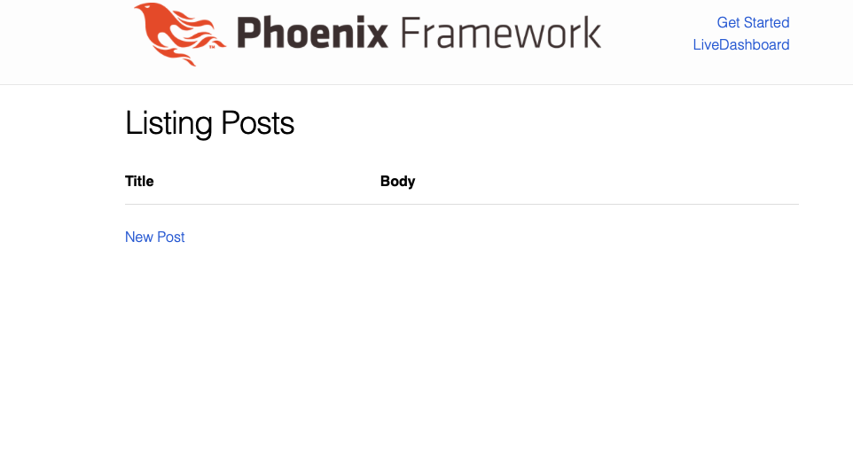

# Introduction to Phoenix

### Why Should you learn Phoenix?

- Phoenix is a very simple webframework to learn. It is very explict in its code which makes it easy to understand what is going on.

- Very fast which means you don't have spend time optimizing every part of your website. 

---

# Step 1 Installing Phoenix 

make sure you have elixir up to date installed we also need hex so type 
``` mix local.hex ``` into your command line.

once installed type ``` mix archiive.install hex phx_new 1.5.4```

It is recommended to install node.js from either 
https://nodejs.org/en/download/ or by installing with brew using ``` brew install node ```

---

If you haven't already installed PostgreSQL we recommend you get it for Phoenix as it configures applications to use it by default. 
``` https://www.postgresql.org/download/ ```

Once everything is installed we can now start to make a phoenix application!

we will create our first application called hello by using the command ```mix phx.new hello```

---

you will be prompted to install dependencies you should type ```y``` to install them. 

``` 
 mix phx.new hello
* creating hello/config/config.exs
* creating hello/config/dev.exs
* creating hello/config/prod.exs
* creating hello/config/prod.secret.exs
...
* creating hello/assets/static/images/phoenix.png
* creating hello/assets/static/robots.txt

Fetch and install dependencies? [Yn] y
* running mix deps.get
* running cd assets && npm install && node node_modules/webpack/bin/webpack.js --mode development
* running mix deps.compile
```

---

next we will cd into our new directory using ``` cd hello ``` then we will create our database using ```mix ecto.create``` once this is done type ```mix phx.server ``` this will run our Phoenix app

Now open your favorite web browser and go to http://localhost:4000

and you will see the Welcome to Phoenix default page! this is your first Phoenix app!

---

## Step 2 Creating a blog

Now the objective of this tutorial will be to create a simple personal blogging website with user authentication to only allow certain people to post.

to exit out of our running phoenix app hit control c in the terminal twice then cd .. out of the hello directory 

we will call our new application blog so start the project with ```mix phx.new blog```

---

## Step 3 generating post pages

now cd into blog and type ```mix ecto.create``` to make our database. Next we will generate pages using ```phx.gen.html``` to easily make a posts page

type ``` mix phx.gen.html Pages Post posts title:string body:text ``` what this command does is generate files for a new page called posts and sets up the database with Posts attributes title which holds a string value and a body which will hold text


----

now all we need to do is copy the line ``` resources "/posts", PostController``` then open up router.ex under lib/blog_web/router.ex and paste it in this block of code 


```elixir 

...
scope "/", BlogWeb do
    pipe_through :browser

    get "/", PageController, :index
    resources "/posts", PostController
  end
...
```

---
type mix ecto.migrate to update your database.

what we have done is added a /posts page to our website if we start our server using mix phx.server again and go to http://localhost:4000/posts
we should see this page!

---



if you click new post it will take us to http://localhost:4000/posts/new
which allows us to enter a post with a title and a body and just like that we have our blog functionality working already!

---

## Step 4 User Authentication

now lets create our user authentication we are going to generate more files using phx.gen so lets create users schema using the command 
``` mix phx.gen.html Accounts User users username:string:unique encrypted_password:string ```


---

add the path to your router and now your router.ex should look like this

```elixir
 scope "/", BlogWeb do
    pipe_through :browser

    get "/", PageController, :index
    resources "/posts", PostController
    resources "/users", UserController
```

---

now again run mix ecto.migrate to update the database
inside our form.html.eex file which is an embedded elixir file under 
lib/blog_web/templates/user/form.html.eex and we will edit the password labels to look like this 

```elixir
  <%= label f, :password, "Password" %>
  <%= password_input f, :encrypted_password%>
  <%= error_tag f, :encrypted_password %>
```

---

This now masks our input and will label the form with the name password rather than encrypted_password

now open app.html.eex under ```lib/blog_web/templates/layout/app.html.eex ``` find the header tag and delete everything in there so we can put a link to sign up as a user

---


```elixir
<%= link "Sign up", to: Routes.user_path(@conn, :new) %>
```

this now gives us a link to sign up from anywhere on the website

you can check this by running the server with mix phx.server and clicking the Sign up link

---

Now we need to include two modules to authenticate our accountswe need the comeonin library so we can encrypt our passwords and we also need to use the bcrypt library to actually hash our passwords

open your file mix.exs and look where your dependencies are and add the following 

```elixir 
{:comeonin, "~> 5.3"},
{:bcrypt_elixir, "~> 2.2.0"},
``` 

---

Now we will fetch our library's with the command mix deps.get
now uwe will open our user.ex file under ```lib/blog/accounts/user.ex```  and update our changeset function with ```Bcrypt.hash_pwd_salt/1```

```elixir 
def changeset(user, attrs) do
    user
    |> cast(attrs, [:username, :encrypted_password])
    |> validate_required([:username, :encrypted_password])
    |> unique_constraint(:username)
    |> update_change(:encrypted_password, &Bcrypt.hash_pwd_salt/1)
  end

```

---

Now once a user signs up the password will be encrypted
to know which user is signed in we should set our session once someone is registered. 

open our user_controller.ex file under ```lib/blog_web/controllers/user_controller.ex``` and set session id as ```:current_user_id``` under the create function and change the route to redirect to the post page

---

```elixir
def create(conn, %{"user" => user_params}) do
    case Accounts.create_user(user_params) do
      {:ok, user} ->
        conn
        |> put_session(:current_user_id, user.id)
        |> put_flash(:info, "User created successfully.")
        |> redirect(to: Routes.post_path(conn, :index))

      {:error, %Ecto.Changeset{} = changeset} ->
        render(conn, "new.html", changeset: changeset)
    end
  end
```

---

Now we need to create a new file to authenticate our users so we will create a new module helpers under lib/blog_web/helpers and create the file auth.ex with the following function

```elixir
defmodule BlogWeb.Helpers.Auth do

  def signed_in?(conn) do
    user_id = Plug.Conn.get_session(conn, :current_user_id)
    if user_id, do: !!Blog.Repo.get(Blog.Accounts.User, user_id)
  end
end

```

---

now we will import our function into blog_web.ex located at ```lib/blog_web.ex```
under the view function 

```elixir
def view do
  quote do
    ...
    import BlogWeb.Helpers.Auth, only: [signed_in?: 1]
  end
end
```

---

now under app.html.eex we can add some logic to show sign out button if we are signed in and sign in and sign up if we aren't. ```lib/blog_web/templates/layout/app.html.eex``` 

add the following under the header section

```elixir
<%= if signed_in?(@conn) do %>
    <%= link "Sign out", to: %>
<% else %>
    <%= link "Sign up", to: Routes.user_path(@conn, :new) %>
    <%= link "Sign in", to:  %>
<% end %>
```

---

These buttons will not work yet as we dont have routes defined for our buttons so lets add them to our router.ex file 

```elixir
scope "/", BlogWeb do
    pipe_through :browser

    ...
    get "/sign-in", SessionController, :new
    post "/sign-in", SessionController, :create
    delete "/sign-out", SessionController, :delete
  end
```

---

We have created now have to create a new controller called session_controller.ex where we will define new, create and delete functions
but first we shouls make a function to get the User map with a user name go to accounts.ex under ```lib/blog/accounts/accounts.ex``` add two functions 

```elixir 

def get_by_username(username) when is_nil(username) do
    nil
end

def get_by_username(username) do
    Repo.get_by(User, username: username)
end
```

now lets create our session_controller under ```lib/blog_web/controllers/session_controller.ex```with our three functions new, create and delete

---

```elixir
defmodule BlogWeb.SessionController do
  use BlogWeb, :controller
  alias Blog.Accounts

  def new(conn, _params) do
    render(conn, "new.html")
  end

end
```

---

Then we will add our create function which will be more complicated 

```elixir

def create(conn, %{"session" => auth_params}) do
    user = Accounts.get_by_username(auth_params["username"])

    case Bcrypt.check_pass(user, auth_params["password"]) do
      {:ok, user} ->
        conn
        |> put_session(:current_user_id, user.id)
        |> put_flash(:info, "Signed in successfully.")
        |> redirect(to: Routes.post_path(conn, :index))
      {:error, _} ->
        conn
        |> put_flash(:error, "There was a problem with your username/password")
        |> render("new.html")
      end
  end
```

---

This function gets the username and uses the check_pass function to ensure the password is correct if its not we prompt the user

and finally we create the delete session function 

```elixir
  def delete(conn, _params) do
    conn
    |> delete_session(:current_user_id)
    |> put_flash(:info, "Signed out successfully.")
    |> redirect(to: Routes.post_path(conn, :index))

   end
```

---

perfect now we need a sign in page we will create the view first under ```lib/blog_web/views/session_view.ex```

```elixir
defmodule BlogWeb.SessionView do
  use BlogWeb, :view

end
```

---

create a new directory session under ```lib/blog_web/template/session```
Then we will create a new template under ```lib/blog_web/template/session/new.html.eex```

then we shall place this code in 

```elixir
<h1>Sign in</h1>
<%= form_for @conn, session_path(@conn, :new), [as: :session], fn f -> %>
  <%= text_input f, :username, placeholder: "username" %>
  <%= password_input f, :password, placeholder: "password" %>
  <%= submit "Sign in" %>
<% end %>
```

---

Now go back to app.html.eex to add our routes

```elixir
<%= if signed_in?(@conn) do %>
    <%= link "Sign out", to: Routes.session_path(@conn, :delete), method:   delete%>
<% else %>
    <%= link "Sign up", to: Routes.user_path(@conn, :new) %>
    <%= link "Sign in", to: Routes.session_path(@conn, :new) %>
<% end %>
```

now lets test out our functions! start your server back up with phx.server
and try to create an account and sign in and sign out!

---

Now it is time to only allow certain users to post blog posts so open post_controller.ex under lib/blog_web/controllers/post_controller.ex
and add the following code 

```elixir

alias Blog.Accounts

  plug :check_auth when action in [:new, :create, :edit, :delete]

  defp check_auth(conn, _args) do
    if (user_id = get_session(conn, :current_user_id))do
      current_user = Accounts.get_user!(user_id)

      conn
      |> assign(:current_user, current_user)
    else
      conn
      |> put_flash(:error, "You are not authorized to create or edit blog posts")
      |> redirect(to: Routes.post_path(conn, :index))
      |> halt()
    end
  end
```

---

We have to alias Blog.Accounts and call a plug to check our user authentication anytime we want to create, edit, new, delete 
now we can tweak our get_auth function to only allow a certain user to make blog posts first we need to add a funciton to accounts.ex under ```lib/blog/accounts.ex``` 

```elixir
def get_username(id) do
    name = Repo.get_by(User, id: id)
    name.username
end
```
this function will return the user name of the user 

---

now all we have to change is add one conditional statement to our function in post_controller.ex under ```lib/blog_web/controllers/post_controller.ex``` 

and our function will look like 

```elixir
defp check_auth(conn, _args) do
    if (user_id = get_session(conn, :current_user_id)) && Accounts.get_username(user_id) == "david" do
      current_user = Accounts.get_user!(user_id)

      conn
      |> assign(:current_user, current_user)
    else
      conn
      |> put_flash(:error, "You are not authorized to create or edit blog posts")
      |> redirect(to: Routes.post_path(conn, :index))
      |> halt()
    end
  end
```

---

Now In my program I will only allow users with the username = "david" to edit blog posts you can change the string to match any username that you enter or want to allow now lets hide the buttons that allow us to edit unless you are signed in as the user 

```elixir
<%= for post <- @posts do %>
    <tr>
      <td><%= post.title %></td>
      <td><%= post.body %></td>

      <td>
      <%= if (user_id = Plug.Conn.get_session(@conn, :current_user_id)) && Blog.Accounts.get_username(user_id) == "david" do %>
        <span><%= link "Show", to: Routes.post_path(@conn, :show, post) %></span>
        <span><%= link "Edit", to: Routes.post_path(@conn, :edit, post) %></span>
        <span><%= link "Delete", to: Routes.post_path(@conn, :delete, post), method: :delete, data: [confirm: "Are you sure?"] %></span>
      <% end %>
      </td>
    </tr>
<% end %>
  </tbody>
</table>

<%= if (user_id = Plug.Conn.get_session(@conn, :current_user_id)) && Blog.Accounts.get_username(user_id) == "david" do %>
  <span><%= link "New Post", to: Routes.post_path(@conn, :new) %></span>
<% end %>

```

---

This now only shows the new post and edit buttons when signed in as the specific user now you have control over your Blog!

One last change we can make is to change the route in router.ex to automatically open up the posts page when we start the website so just simply change this line of code

```elixir
get "/", PageController, :index
```
to ```get "/", PostController, :index```